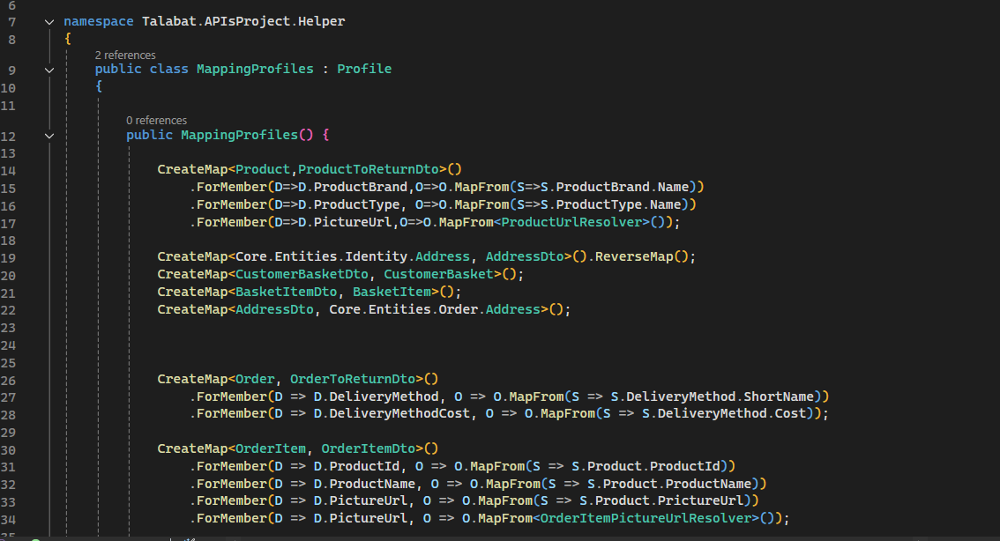

1- build your solution layers 
     -Apis
     -Core
     -Repository
     -Service

2- make classes (DataBase)

3- Create DbContext => make ur database , install (entity.framworks.core) then make constractor for DbContext , make options for DbContextOptions int program file 
to ask CLR to ingict an opject from  DbContextOptions<-MyDataBaseName->
, make my classes that will be table in my database
, make configurations in my classes (My relations and key ...) so we make folder "Config" to add all configurations
, after that we make migrations .
, make the update auto by code in main with get scops from app and get services and getRequiredServes then make .databse.migrate 
, use try catch with logger factory like the database update mean use services.geatrequired>ILoggerFactoruy< 

----------------------^^^^^^^^^^^^^^^^^^^^^------------------------------كله موجود في الفيديو الي عملته

- Create DTOs folder in API layer 
- to make auto mapping use IMapper and Ask CLR to Create opject =>> builder.Service.addAutoMapper("Profile") 
 
            builder.Services.AddAutoMapper(AppDomain.CurrentDomain.GetAssemblies()); //from // https://www.youtube.com/watch?v=87fhsf8gfDg&t=71s 
 

we create profile الي علي اساسه بيخصل التحول من الكلاس لل DTO 
و مش شرط اعمل بروفايل منفصل لكل انتتي عندي لا انا بعمل بروفايل فيه كل حاجه عايز احولها و من جوا انا بزبط الاعدادات عادي
يغتي بيكون كلاس واحد 
 
-------vvvvvvvvvvvvvvvvvvvvvvvvvvvvvvvvvvvvvvvvv---------------------------------.
 

 
  